# Android kernel 编译记(一)

事情是这样的，作为一个 docker 粉，我一直想把这玩意带走（指装进手机）

然而同为 Linux 内核的 Android 并不能原生运行 docker，因为缺了一堆内核模块

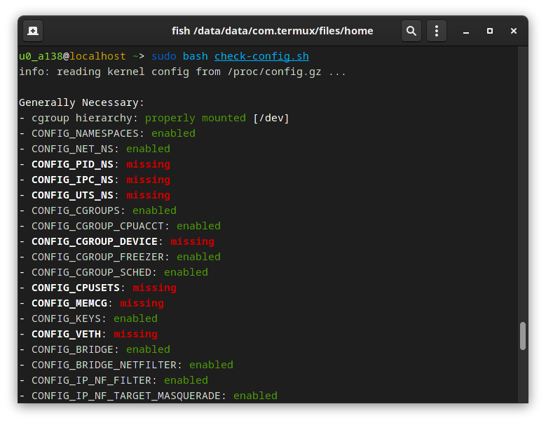

> [检测工具地址](https://github.com/moby/moby/blob/master/contrib/check-config.sh)

所以，这次的目标就是给我的手机整一个定制的支持 docker 的内核

> 本篇文章参考 Ivon 的[这篇博客](https://ivon852.github.io/2021/12/26/%E5%A6%82%E4%BD%95%E7%B7%A8%E8%AD%AF%E4%BF%AE%E6%94%B9Android-Kernel-%E5%85%A7%E6%A0%B8/)

行业惯例，上配置：

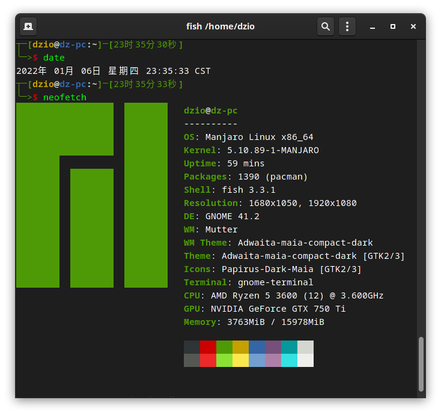  
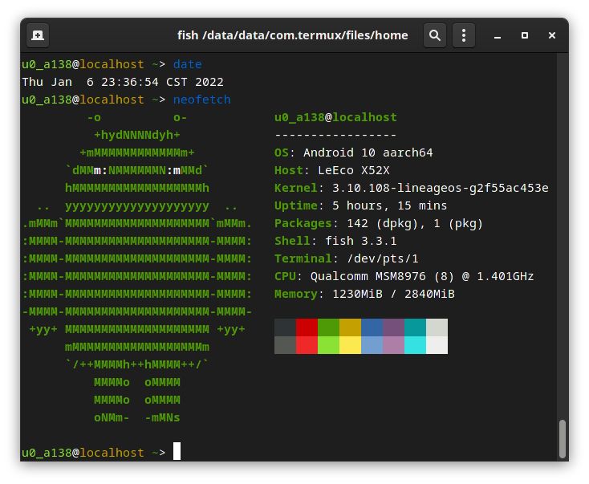

## 一、搭建环境

我参考的那个博主搭建内核时用的是自己的 Lubuntu 20.04，至于我自己。。。当然是用 docker

```bash
docker run -it ubuntu-20.04
```

当然新开容器先把源换了

```bash
sed -i s/archive.ubuntu/mirrors.huaweicloud/g /etc/apt/sources.list
sed -i s/security.ubuntu/mirrors.huaweicloud/g /etc/apt/sources.list
apt update && apt upgrade -y
```

然后搭建环境

```bash
apt install git-core gnupg flex bison gperf build-essential zip curl zlib1g-dev \
    gcc-multilib g++-multilib libc6-dev-i386 lib32ncurses5-dev \
    x11proto-core-dev libx11-dev lib32z-dev libgl1-mesa-dev \
    libxml2-utils xsltproc unzip bc wget git python -y
```

下一步安装交叉编译器

到[XDA](https://forum.xda-developers.com/t/gcc-toolchain-eva-gcc-calling-all-kernel-devs.4221409/)获取所需要的编译器

> 原作者给的是`bit.ly`的链接,这里给一个免梯子解`bit.ly`的方法  
> 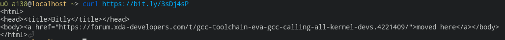  
> (截这张图的时候我的境外vps坏了，所以我在安卓手机上截的)  

图里高亮这俩链接用 wget 下载，下一个解压一个

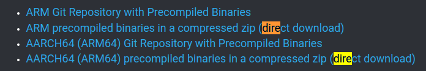

全部弄完就是这样：

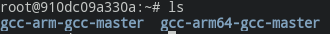

添加编译器环境变量

```bash
export CROSS_COMPILE=/root/gcc-arm64-gcc-master/bin/aarch64-elf-
export CROSS_COMPILE_ARM32=/root/gcc-arm-gcc-master/bin/arm-eabi-
export ARCH=arm64
```

然后到[XDA](https://forum.xda-developers.com/t/tool-android-image-kitchen-unpack-repack-kernel-ramdisk-win-android-linux-mac.2073775/)下载 AIK,用 wget 下这个,可以边下边解

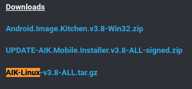

> ```bash
> #边下边解命令
> wget -O- https://forum.xda-developers.com/attachments/aik-linux-v3-8-all-tar-gz.5300923/|tar -xz
> ```

把 AIK 加入 PATH

```bash
export PATH=$(pwd)/AIK-Linux-$PATH
```

配置 GH 加速

```bash
git config --global url."https://hub.fastgit.org/".insteadOf "https://github.com/"
```

至此，环境搭建完成

## 二、下载源码并编译内核

有小伙伴可能卡在这里了，其实如果你使用的是 lineageos 的话，内核挺好找的

搜索`lineageos wiki`+手机型号，然后点那个带`Info about`的

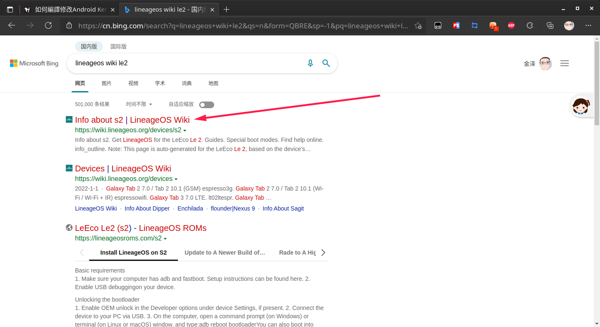

然后点击`Build for yourself`

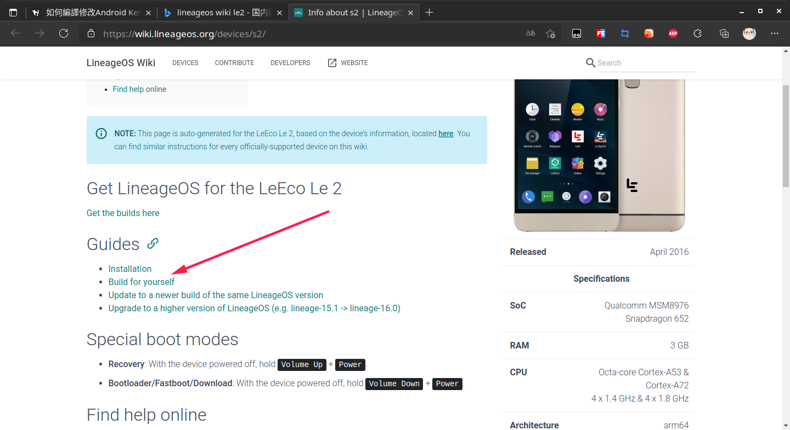

Ctrl+F 搜 kernel，找这行

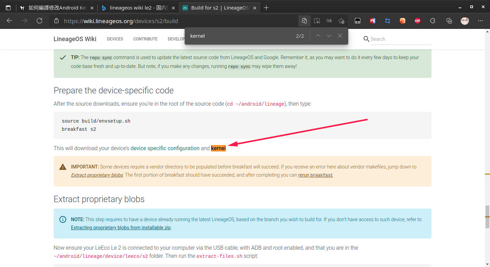

那个 kernel 就是，复制链接备用

下一步我们准备换 vsc 环境方便开发，用 vsc 链接容器

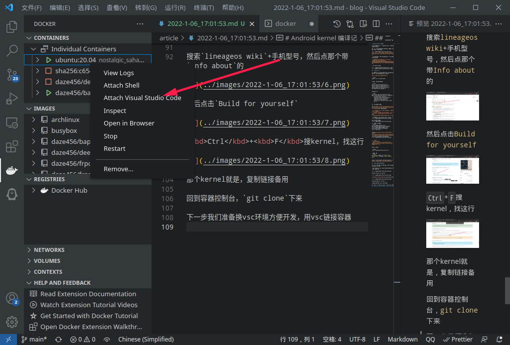

打开终端，把 kernel `git clone`下来

```bash
git clone https://github.com/LineageOS/android_kernel_leeco_msm8976
```

然后用 code 打开

```bash
code android_kernel_leeco_msm8976
```

之后会跑出一个 vscode，在那个上面打开终端继续操作

先配置交叉编译

```bash
export CROSS_COMPILE=/root/gcc-arm64-gcc-master/bin/aarch64-elf-
export CROSS_COMPILE_ARM32=/root/gcc-arm-gcc-master/bin/arm-eabi-
export ARCH=arm64
```

先展开`arch/arm64/configs`，然后可以看到我们要找的配置文件是`lineage_s2_defconfig`

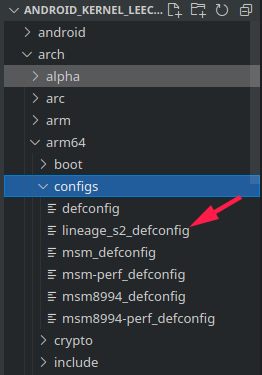

执行`make 配置文件`生成配置文件

结果报错少了 python2，安装后报错消失

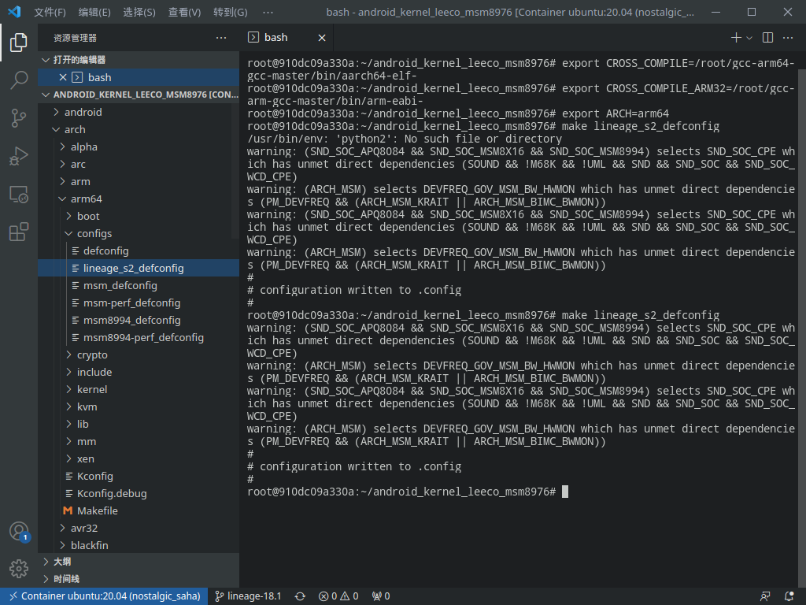

> 其实还有一段我忘记配置环境变量了。。。

然后修改 EXTRAVERSION 和.config

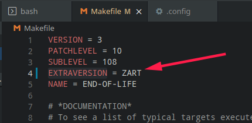

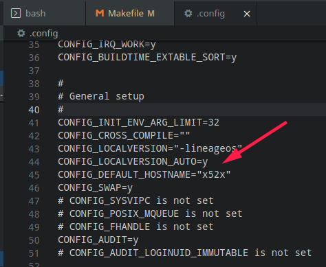

下一步老规矩，make -j 几来着？

> j 是指允许几个编译命令同时进行，简单点说就是几个框框 j 就设几，所以我的是`make -j12`

然后喜闻乐见的爆了

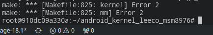

不过我这人比较猛也比较懒，分支用的最新的，换分支到 17.1 试下，直接编译，又爆了

> 其实能理解，毕竟这次编译的是 3.10 的老内核，所以爆了能理解
